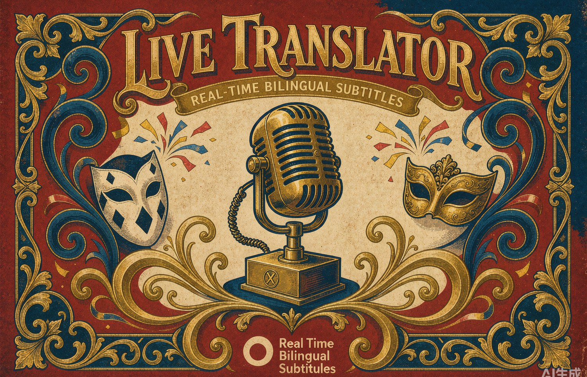
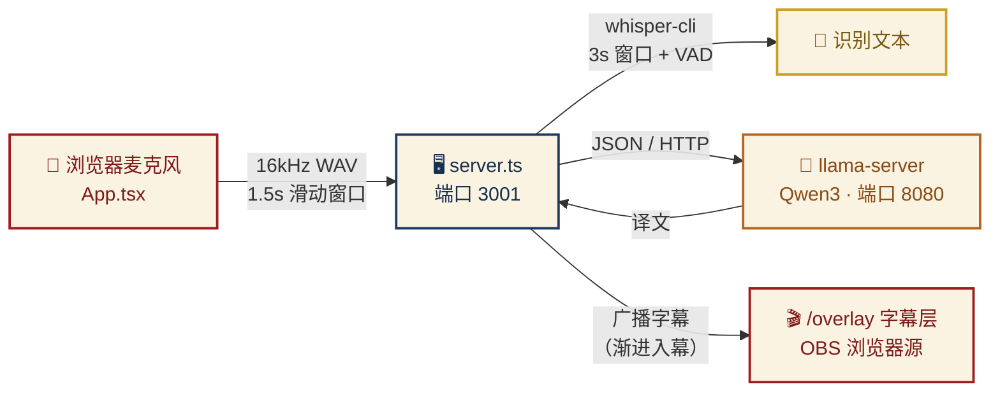

<div align="center">



### ✦ 实时双语直播字幕 · 全程本地运行 ✦

麦克风 → **Whisper.cpp** 语音识别 → **Qwen3** 本地翻译 → 浏览器字幕层（可直接作为 OBS 浏览器源）

**不依赖任何云服务 · 不需要 API Key · 数据不出本机**


</div>

<div align="center">

</div>

> ### 🎭 写给朋友的话
>
> 朋友你好呀！这个小东西是我连着好几个晚上一点点抠出来的——从语音幻听到翻译复读，每个功能都是踩坑踩出来的。
> 安装哪一步卡住了别慌，随时来找我。祝你直播顺利！🎉
>
> —— sunnnnnshineeee

<div align="center">

</div>

<h2 align="center">✦ ⚡ 特性亮点 ✦</h2>

| | 特性 | 说明 |
|:---:|---|---|
| ⚡ | **渐进入幕** | 原文 ~1.8 秒先上屏，译文完成后自动替换为双语 |
| 🛡️ | **反幻听三件套** | VAD + RMS 静音门限 + 第三语言过滤，无声时不再"凭空说话" |
| 🔁 | **自动双向** | 中文 ⇄ 英文自动检测方向，也可手动锁定 |
| ✂️ | **智能断句** | 标点优先，停顿 1.2 秒自动提交 |
| 🚫 | **复读克星** | 方向守卫检测到"原样复读"自动强制重译 |

<div align="center">

</div>

<h2 align="center">✦ 🧠 工作原理 ✦</h2>



<div align="center">

</div>

<h2 align="center">✦ 📋 环境要求 ✦</h2>

### 🖥️ 硬件

| 项目 | 最低要求 |
|:---:|---|
| 💾 内存 | **8 GB**（Windows：Whisper ~1.5 GB + Qwen3-1.7B ~1.5 GB）；macOS 用 4B 时建议 16 GB |
| 🔧 CPU | 8 线程以上（Apple Silicon M 系列，或近几年的 x86 桌面 CPU） |
| 💿 磁盘 | ~3.5 GB（Windows）；macOS 用 4B 时 ~5 GB |
| 🪟 系统 | macOS（Apple Silicon）或 Windows 10/11 64 位 |

> 💡 **翻译模型分两档**：Windows 脚本默认 **Qwen3-1.7B**（CPU 快），macOS 脚本默认 **Qwen3-4B**（走 Metal GPU，质量更好）。想互换只改脚本里一行模型名。**有 N 卡强烈建议**下载 llama.cpp 的 `-cuda` 版本，比 CPU 快一个量级。

### 📦 软件

| 软件 | 说明 | 下载 |
|---|---|---|
| **Node.js ≥ 20** | 前端 + 后端运行时 | <https://nodejs.org> |
| **Git** | 克隆仓库 | <https://git-scm.com> |
| **CMake** + C++ 编译器 | 编译 whisper.cpp | 见下方 |

<details>
<summary>🔧 CMake / 编译器安装说明（点击展开）</summary>

- **macOS**：终端执行 `xcode-select --install`，然后 `brew install cmake`
- **Windows**：安装 [Visual Studio 2022 Community](https://visualstudio.microsoft.com/)（免费），安装时勾选 **「使用 C++ 的桌面开发」** 工作负载，自带 CMake

</details>

<div align="center">

</div>

<h2 align="center">✦ 🚀 快速开始 ✦</h2>

以下命令均在项目根目录执行。

### ① 克隆仓库并安装依赖

```bash
git clone https://github.com/sunnnnnshineeee-bit/live-translator.git
cd live-translator
npm install
```

### ② 下载模型（一次性）

模型文件不进 git，用脚本下载（国内走 hf-mirror.com，海外自动回退 HuggingFace，支持断点续传）：

| 平台 | 命令 | 体积 | 翻译模型 |
|:---:|---|:---:|:---:|
| 🍎 macOS / Linux | `bash scripts/download-models.sh` | ~3.4 GB | Qwen3-4B |
| 🪟 Windows | `powershell -ExecutionPolicy Bypass -File scripts\download-models.ps1` | ~1.6 GB | Qwen3-1.7B |

下载完成后会有这些文件：

| 文件 | 用途 | 体积 |
|---|---|:---:|
| `whisper.cpp/models/ggml-large-v3-turbo-q5_0.bin` | 语音识别 | 574 MB |
| `whisper.cpp/models/ggml-silero-v6.2.0.bin` | VAD 静音检测 | 864 KB |
| `models/Qwen3-4B-Q4_K_M.gguf` | 翻译（macOS） | 2.3 GB |
| `models/Qwen3-1.7B-Q4_K_M.gguf` | 翻译（Windows） | 1.0 GB |

### ③ 编译 whisper.cpp

```bash
git clone https://github.com/ggml-org/whisper.cpp
cd whisper.cpp
cmake -B build
cmake --build build -j              # 🍎 macOS / Linux
# cmake --build build --config Release   ← 🪟 Windows 用这条
cd ..
```

> 📌 编译产物位置：macOS 在 `whisper.cpp/build/bin/whisper-cli`，Windows 在 `whisper.cpp/build/bin/Release/whisper-cli.exe`

### ④ 准备 llama.cpp（跑翻译模型）

<details>
<summary>🪟 Windows（点击展开）</summary>

到 <https://github.com/ggml-org/llama.cpp/releases> 下载最新的 `llama-bXXXX-bin-win-cpu-x64.zip`（有 N 卡就下 `win-cuda` 版本），把压缩包里**全部文件**解压到项目的 `llama\` 文件夹（没有就新建）。

</details>

<details>
<summary>🍎 macOS（点击展开）</summary>

`brew install llama.cpp`，或自行编译，确保 `llama/llama-server` 存在（本仓库的启动脚本按此路径找）。

</details>

<div align="center">

</div>

<h2 align="center">✦ ▶️ 运行（需要开 3 个终端） ✦</h2>

```bash
# 终端 1️⃣  翻译模型服务（端口 8080）
bash scripts/start-llama.sh                        # 🍎 macOS / Linux
# 🪟 Windows:
# powershell -ExecutionPolicy Bypass -File scripts\start-llama.ps1

# 终端 2️⃣  字幕后端（端口 3001）
npx tsx server.ts

# 终端 3️⃣  前端
npm run dev
```

打开 <http://localhost:5173>：

1. ✅ 允许麦克风权限，选择麦克风
2. 🌐 语言选 **「自动（英↔中 双向）」**
3. ▶️ 点 **Start Translation**，开始说话！

<div align="center">

</div>

<h2 align="center">✦ 🎬 接入 OBS ✦</h2>

1. OBS → 添加 **浏览器源**
2. URL 填 `http://localhost:5173/overlay`，宽 **1200** 高 **300**
3. 说话时字幕自动出现，原文 + 译文双语显示

> ⚠️ 直播结束记得点 **Stop Translation**——会触发 flush，把最后半句提交翻译完再退出。

<div align="center">

</div>

<h2 align="center">✦ 📁 项目结构 ✦</h2>

<details>
<summary>点击展开</summary>

```
├── server.ts            # 后端：音频队列、断句、翻译调度、WebSocket 广播
├── whisperService.ts    # whisper-cli 子进程封装
├── audioUtils.ts        # 音频工具
├── src/
│   ├── App.tsx          # 控制面板（麦克风、语言、字幕预览）
│   ├── Overlay.tsx      # OBS 字幕层（/overlay 路由）
│   └── services/        # AudioRecorder（16kHz 采集 + 滑动窗口切片）
├── scripts/
│   ├── download-models.sh / .ps1   # 模型下载（hf-mirror 优先）
│   └── start-llama.sh / .ps1       # llama-server 启动
├── whisper.cpp/         # （本地克隆+编译，不进 git）
├── models/              # Qwen 模型（不进 git）
└── llama/               # llama-server 二进制（不进 git）
```

</details>

<div align="center">

</div>

<h2 align="center">✦ 🔧 故障排查 ✦</h2>

| 症状 | 原因 / 解决 |
|---|---|
| 🔁 改了 server.ts 没生效 | **tsx 不热重载**，Ctrl+C 后重新 `npx tsx server.ts` |
| ⬜ Overlay 一片空白 | 确认三个终端都开着；浏览器 F12 看 Console 报错 |
| ⏳ 翻译一直转不出来 | llama-server 没起来或 8080 被占用：`curl http://127.0.0.1:8080/health` |
| 👻 无声时出幻听字幕 | 检查 `whisper.cpp/models/ggml-silero-v6.2.0.bin` 是否下载成功 |
| 🐌 连续说话越来越卡 | CPU 扛不住 3s 窗口：看终端 `Processing audio queue: N remaining`，N 持续上涨就把 start-llama 里 `-np 2` 改成 `-np 1`，或换小模型 |
| 🔌 端口冲突 | 3001（后端）/ 8080（llama）/ 5173（前端）被占用时改对应配置 |

<div align="center">

</div>

<h2 align="center">✦ ⚠️ 已知限制 ✦</h2>

- 识别语言仅支持**中文、英文**（其他语言按幻觉过滤丢弃）
- Windows 纯 CPU + 1.7B 模型下，译文总延迟约 **3–5 秒**（原文渐进入幕 ~2 秒先出）；有 N 卡装 CUDA 版 llama.cpp 可降到 ~2 秒
- 1.7B 翻译质量略低于 4B：短句基本无差别，长难句偶有不顺、偶发繁体中文（方向守卫会兜底重试）。追求质量可在 Windows 上也改用 4B（换下载脚本里一行模型名，内存需 16 GB）
- 浏览器要求桌面版 **Chrome / Edge**（ScriptProcessorNode + WebSocket）

<div align="center">

</div>

<div align="center">

### ✦ 用 ❤️ 与踩不完的坑，为你而做 ✦

`© sunnnnnshineeee · Live Translator`

</div>
