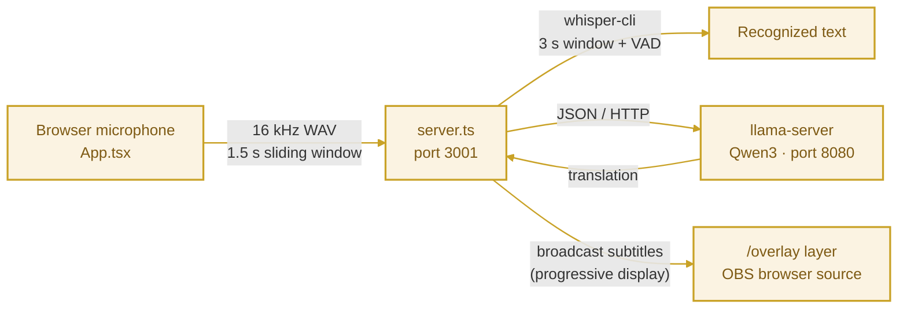

<div align="center">

### ✦ Live Translator for the Star ✦

Microphone → **Whisper.cpp** speech recognition → **Qwen3** local translation → browser subtitle overlay (works directly as an OBS browser source)

**No cloud services · No API keys · Your data never leaves your machine**


</div>

<div align="center">

</div>

> ### A Note for My Friend
>
> I originally thought I could finish this in a week! It ended up taking a whole month of on-and-off tinkering. I hope this little translator proves helpful to the Star (o^^o)
>
> —— 烧鸭

<div align="center">

</div>

<h2 align="center">✦ Highlights ✦</h2>

| Feature | Description |
|---|---|
| **Progressive display** | Original text on screen in ~1.8 s, automatically replaced by bilingual subtitles once the translation finishes |
| **Anti-hallucination trio** | VAD + RMS silence gate + third-language filtering — no more "ghost subtitles" during silence |
| **Auto bidirectional** | Chinese ⇄ English direction detected automatically, or locked manually |
| **Smart segmentation** | Punctuation first; a 1.2 s pause auto-submits the sentence |
| **Repetition killer** | A direction guard detects "same-language echo" output and forces a re-translation |

<div align="center">

</div>

<h2 align="center">✦ How It Works ✦</h2>



<div align="center">

</div>

<h2 align="center">✦ Requirements ✦</h2>

### Hardware

| Item | Minimum |
|:---:|---|
| Memory | **8 GB** (Windows: Whisper ~1.5 GB + Qwen3-1.7B ~1.5 GB); 16 GB recommended on macOS with the 4B model |
| CPU | 8+ threads (Apple Silicon M series, or a recent x86 desktop CPU) |
| Disk | ~3.5 GB (Windows); ~5 GB on macOS with the 4B model |
| OS | macOS (Apple Silicon) or Windows 10/11 64-bit |

> [!NOTE]
> **Two translation model tiers**: the Windows scripts default to **Qwen3-1.7B** (fast on CPU), the macOS scripts default to **Qwen3-4B** (Metal GPU, better quality). Swapping them is a one-line change in the script. **If you have an NVIDIA GPU**, strongly consider the `-cuda` build of llama.cpp — an order of magnitude faster than CPU.

### Software

| Software | Purpose | Download |
|---|---|---|
| **Node.js ≥ 20** | Frontend + backend runtime | <https://nodejs.org> |
| **Git** | Cloning this repo | <https://git-scm.com> |
| **CMake** + C++ compiler | Building whisper.cpp | See below |

<details>
<summary>CMake / compiler setup (click to expand)</summary>

- **macOS**: run `xcode-select --install`, then `brew install cmake`
- **Windows**: install [Visual Studio 2022 Community](https://visualstudio.microsoft.com/) (free); when installing, check the **"Desktop development with C++"** workload — CMake is included

</details>

<div align="center">

</div>

<h2 align="center">✦ Quick Start ✦</h2>

All commands below run in the project root.

### 1. Clone the repo and install dependencies

Run in Terminal (macOS) or PowerShell (Windows) — same commands on both platforms:

```bash
git clone https://github.com/sunnnnnshineeee-bit/live-translator.git
cd live-translator
npm install
```

### 2. Download the models (one-time)

Model files are not stored in git — download them with the scripts (hf-mirror.com first, automatic fallback to HuggingFace, resumable):

| Platform | Command | Size | Translation model |
|:---:|---|:---:|:---:|
| macOS / Linux | `bash scripts/download-models.sh` | ~3.4 GB | Qwen3-4B |
| Windows | `powershell -ExecutionPolicy Bypass -File scripts\download-models.ps1` | ~1.6 GB | Qwen3-1.7B |

After downloading you will have these files:

| File | Purpose | Size |
|---|---|:---:|
| `whisper.cpp/models/ggml-large-v3-turbo-q5_0.bin` | Speech recognition | 574 MB |
| `whisper.cpp/models/ggml-silero-v6.2.0.bin` | VAD silence detection | 864 KB |
| `models/Qwen3-4B-Q4_K_M.gguf` | Translation (macOS) | 2.3 GB |
| `models/Qwen3-1.7B-Q4_K_M.gguf` | Translation (Windows) | 1.0 GB |

### 3. Build whisper.cpp

**macOS / Linux (Terminal):**

```bash
git clone https://github.com/ggml-org/whisper.cpp
cd whisper.cpp
cmake -B build
cmake --build build -j
cd ..
```

**Windows (PowerShell):**

```powershell
git clone https://github.com/ggml-org/whisper.cpp
cd whisper.cpp
cmake -B build
cmake --build build --config Release
cd ..
```

> [!NOTE]
> Build output locations: macOS — `whisper.cpp/build/bin/whisper-cli`; Windows — `whisper.cpp/build/bin/Release/whisper-cli.exe`

### 4. Set up llama.cpp (runs the translation model)

<details>
<summary>Windows (click to expand)</summary>

Download the latest `llama-bXXXX-bin-win-cpu-x64.zip` from <https://github.com/ggml-org/llama.cpp/releases> (pick the `win-cuda` build if you have an NVIDIA GPU) and extract **all files** from the archive into the project's `llama\` folder (create it if it doesn't exist).

</details>

<details>
<summary>macOS (click to expand)</summary>

Run `brew install llama.cpp`, or build it yourself — just make sure `llama/llama-server` exists (the startup scripts in this repo look for it there).

</details>

<div align="center">

</div>

<h2 align="center">✦ Running (3 terminals) ✦</h2>

**Terminal 1 — translation model server (port 8080):**

```bash
bash scripts/start-llama.sh                          # macOS / Linux
```

```powershell
powershell -ExecutionPolicy Bypass -File scripts\start-llama.ps1    # Windows
```

**Terminal 2 — subtitle backend (port 3001):** (same on both platforms)

```bash
npx tsx server.ts
```

**Terminal 3 — frontend:** (same on both platforms)

```bash
npm run dev
```

Open <http://localhost:5173>:

1. Allow microphone access and pick your microphone
2. Set the language to **"Auto (English ↔ Chinese, bidirectional)"**
3. Click **Start Translation** and start talking!

<div align="center">

</div>

<h2 align="center">✦ OBS Integration ✦</h2>

1. In OBS, add a **Browser source**
2. Set the URL to `http://localhost:5173/overlay`, width **1200**, height **300**
3. Subtitles appear automatically as you speak — original text plus translation, side by side

> [!WARNING]
> When your stream ends, click **Stop Translation** — it triggers a flush that submits the last half-sentence for translation before shutting down.

<div align="center">

</div>

<h2 align="center">✦ Project Structure ✦</h2>

<details>
<summary>Click to expand</summary>

```
├── server.ts            # Backend: audio queue, segmentation, translation scheduling, WebSocket broadcast
├── whisperService.ts    # whisper-cli subprocess wrapper
├── audioUtils.ts        # Audio utilities
├── src/
│   ├── App.tsx          # Control panel (microphone, language, subtitle preview)
│   ├── Overlay.tsx      # OBS subtitle layer (/overlay route)
│   └── services/        # AudioRecorder (16 kHz capture + sliding-window slicing)
├── scripts/
│   ├── download-models.sh / .ps1   # Model download (hf-mirror first)
│   └── start-llama.sh / .ps1       # llama-server startup
├── whisper.cpp/         # (cloned + built locally, not in git)
├── models/              # Qwen models (not in git)
└── llama/               # llama-server binaries (not in git)
```

</details>

<div align="center">

</div>

<h2 align="center">✦ Troubleshooting ✦</h2>

| Symptom | Cause / Fix |
|---|---|
| Edited server.ts but nothing changed | **tsx has no hot reload** — press Ctrl+C and rerun `npx tsx server.ts` |
| Overlay is completely blank | Make sure all three terminals are running; check the browser console (F12) for errors |
| Translation never arrives | llama-server isn't running, or port 8080 is occupied: `curl http://127.0.0.1:8080/health` |
| Ghost subtitles during silence | Check that `whisper.cpp/models/ggml-silero-v6.2.0.bin` downloaded successfully |
| Gets laggier the longer I talk | CPU can't keep up with the 3 s window: watch `Processing audio queue: N remaining` in the terminal — if N keeps climbing, change `-np 2` to `-np 1` in start-llama, or switch to a smaller model |
| Port conflicts | 3001 (backend) / 8080 (llama) / 5173 (frontend) — adjust the corresponding config when occupied |

<div align="center">

</div>

<h2 align="center">✦ Known Limitations ✦</h2>

- Recognition supports **Chinese and English only** (other languages are filtered out as hallucinations)
- On pure-CPU Windows with the 1.7B model, total subtitle latency is about **3–5 s** (the original text appears first via progressive display in ~2 s); an NVIDIA GPU with the CUDA build of llama.cpp brings it down to ~2 s
- The 1.7B model's translation quality is slightly below the 4B's: short sentences are essentially identical, but long, difficult sentences occasionally come out awkwardly or in Traditional Chinese (the direction guard retries as a fallback). For best quality, switch to the 4B model on Windows too (one line in the download script; needs 16 GB RAM)
- Requires a desktop **Chrome / Edge** browser (ScriptProcessorNode + WebSocket)
